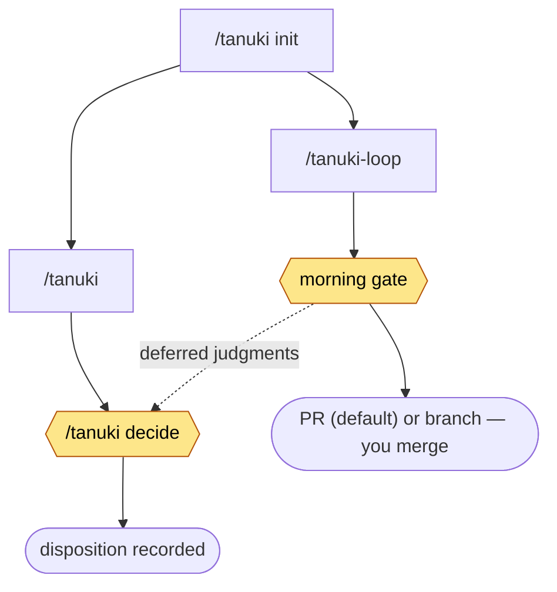

<p align="center">
  
</p>

# Tanuki 🦝

<p align="center">
  <a href="https://github.com/tim-nish/tanuki/actions/workflows/tests.yml"></a>
  <a href="LICENSE"></a>
</p>

**Tanuki automatically executes realistic user scenarios against your Claude
Code plugin and turns the recurring usability problems it discovers into
concrete outcomes: the attended pipeline ends in a ranked proposal brief with
a recorded disposition for each item, and the unattended overnight loop ends
in a reviewable implementation batch that only you merge.**

Unit tests and linters verify the code you wrote: functions return the right
values, links resolve, schemas parse. They cannot tell you that a first-time
user gets lost after step 2 of your README, that an error message gives no
hint how to recover, or that one branch of your command asks a question
nobody understands. Those problems only surface when someone actually *uses*
the plugin — and collecting them normally means hours of manual dogfooding or
waiting for user complaints. Tanuki automates the user.

The central idea: **Claude acts as a simulated user, not as a code
generator.** For each scenario, Tanuki launches a headless Claude session on
a deliberately *less capable* model that plays a persona — "a new user
follows the quickstart", "a user picks the option you never test", "a user
whose config file is broken" — inside a disposable clone of your repo. The
weaker model is the point: a stronger model quietly works around rough
edges, while a weaker one trips over them, which is exactly the signal a
plugin author needs. The thing being tested is not the code — it's the
experience of using it.

So if you've built a plugin that works when *you* use it — because you know
exactly which buttons to press — Tanuki answers the questions you can't
answer yourself: what happens to everyone else?

**You stay in control.** The attended pipeline is proposals-only: it runs
against disposable clones and does not modify the target repo — its output is
a brief for your review, and filing an issue is an explicit, per-item choice.
The overnight loop writes only to its own integration branch inside a
dedicated worktree — never your default branch, never your working tree —
until the attended morning gate, where only you merge (on a PR-protected
target the close pushes that integration branch to open one Draft PR; see
Unattended overnight mode). This is the spec's standing constraint
([docs/tanuki-spec.md](docs/tanuki-spec.md)), not a habit.

Full technical contract: [docs/tanuki-spec.md](docs/tanuki-spec.md).

## Install

Tanuki is itself a Claude Code plugin; this repository doubles as its
marketplace. Inside Claude Code:

```
/plugin marketplace add tim-nish/tanuki
/plugin install tanuki@tanuki
```

Requirements: the `claude` CLI on PATH, `git`, Python 3. Nothing else — no
pip packages, no configuration files needed to start.

## Quickstart

```
cd ~/work/my-plugin
/tanuki init          # one-time onboarding: Tanuki reads your plugin's docs
                      # and proposes 4–6 test scenarios for your approval
/tanuki               # run it — shows the plan first, drives after you approve
```

That's the whole loop. Every mode you can run afterward is in the
[Command index](#command-index) below.

**One rule for the grammar:** a **bare word** is a mode that doesn't drive
(`init`, `decide`, `status`, `history`, `view`, `ingest`, `mine`, `generate`,
`configure`, `distill`); flags modify a drive; the bare default *is* driving.
The older spellings — `--brief`, `--status`, `--history`, `--ingest`,
`--mine-only` — still work as aliases, so nothing in your fingers breaks.

Every run ends with a **delta report** — which known problems recurred and
what's new — so you never need to remember previous runs.

## How it works, in one paragraph

Tanuki clones your plugin (and optionally a "host" repo it operates on) into
a throwaway workspace and drives one simulated-user session per scenario.
Each transcript is mechanically normalized into **Events** (tool errors,
retries, user choices, friction notes). A mining pass turns events into
**Findings** — deduplicated problems with a recurrence count, so a problem
seen in three runs counts as chronic, not three separate complaints. Chronic
findings get promoted into a **brief**: at most 10 ranked **Proposals**, each
written as Problem → Proposed fix → Evidence. You then accept, dismiss, or
defer each one in-session. (The stage-by-stage pipeline diagram is in
[Pipeline internals](#pipeline-internals) below; the full contract is
[docs/tanuki-spec.md](docs/tanuki-spec.md).)

## Two command families, and the basic sequence

Tanuki has two user-facing command families. Everything else is internal
machinery those two drive.

- **`/tanuki`** — the **attended** pipeline you run and watch: drive a run,
  read the brief, decide each proposal. You are in the loop for every run.
- **`/tanuki-loop`** — the **unattended** overnight loop: it repeats the whole
  cycle on its own integration branch and hands you one batch to review in the
  morning. The human gate is *relocated* here, not removed — only you merge.

After onboarding with `/tanuki init`, the flow branches into the two modes.
They deliberately end differently, because they answer different questions:
`/tanuki` **finds** problems and hands you proposals — its endpoint is a
recorded disposition for each one (accept / dismiss / defer) — while
`/tanuki-loop` **fixes** problems overnight and hands you a batch — the
morning gate ends at a **delivery you review and merge**: by default a
ready-for-review PR (`integration → base`), or a branch-only target leaves the
integration branch for you to merge. The loop never merges to `main` itself
(triage of #262/#263). What the two share is the
human gate `/tanuki decide`: it decides the attended run's proposals, and
**only** the loop's *deferred* judgment items return to it — everything the
loop implemented overnight goes through the morning gate instead.



- **`/tanuki init`** — one-time onboarding; writes the scenario file both
  modes run from.
- **`/tanuki decide`** — the human gate for judgment, on both paths: each
  proposal ends with a recorded disposition — accept, dismiss, or defer. For
  an accepted finding you may *optionally* file the prepared GitHub issue
  (its own explicit confirmation; nothing is ever auto-filed). The loop's
  deferred spec/judgment items arrive here too, because the loop never
  decides those on its own.
- **morning gate** — the loop's human gate, in summary: you review the
  integration branch diff, run the final tests, and take delivery — approve +
  merge the ready-for-review PR the loop opened (default), or merge the
  branch-only target's integration branch yourself; the loop never merges to
  `main`. The fixing already happened overnight on the loop's own branch, so
  this gate reviews and
  lands — it does not implement. The complete step-by-step specification is
  [commands/tanuki-loop.md §2](commands/tanuki-loop.md#2-morning-gate-attended--invariant-in-every-phase).

Everything the loop writes stays on its own integration branch — never in the
repo under test — until you merge.

## Command index

Every shipped command, with a link to its definition. The **command file is
the authority** — where a one-line description here and the command file
disagree, the command file wins; this index points into it rather than
restating it. Each tool also prints its complete option surface with `--help`.

### `/tanuki` — attended pipeline ([`commands/tanuki.md`](commands/tanuki.md))

| command | what it does |
|---|---|
| `/tanuki init` | one-time onboarding: read the plugin's docs, propose 4–6 scenarios for approval ([details](commands/tanuki.md#init-tanuki-init--the-normal-onboarding-flow)) |
| `/tanuki [target]` | drive a run — shows the plan, drives after you approve, ends in decisions |
| `/tanuki <t> <scenario-id>[,…]` | drive only the named scenarios |
| `/tanuki "<free text>"` | one-off ad-hoc scenario ("probe the present") ([details](commands/tanuki.md#ad-hoc-scenarios-free-text--probe-the-present)) |
| `/tanuki <t> decide` | the human gate: record a disposition for everything pending; filing each prepared issue is optional ([details](commands/tanuki.md#4-decide-the-human-gate--part-of-the-run-not-homework)) |
| `/tanuki <t> ingest "<text>"` | log friction you hit yourself, in plain words ([details](commands/tanuki.md#ingest-mode-ingest-feedback-alias---ingest--human-feedback-is-one-more-event-source)) |
| `/tanuki <t> status` | what's still waiting on your decision, plus generation-trigger advisories |
| `/tanuki <t> history [scenario]` | the long view: what's been explored, per-scenario on request |
| `/tanuki <t> view [name]` | the read-only view surface — picker, or jump to `status`, `live`, `history`, `trajectory` ([details](commands/tanuki.md#views-tanuki-target-view-name--the-read-only-surface)) |
| `/tanuki <t> mine <run-id>` | re-mine a crashed or interrupted run |
| `/tanuki <t> generate` | the regeneration pass: propose new charters at a plan gate (feature drift, empty pool, or on demand) — never automatic |
| `/tanuki <t> configure` | guided configuration over declared inputs and the built-in catalog — the primary way to change settings |
| `/tanuki <t> distill` | walk lesson candidates from the existing ledger into your configured knowledge hub |

Bare words (`init`, `decide`, `status`, `history`, `view`, `ingest`, `mine`,
`generate`, `configure`, `distill`) are modes that don't drive; a flag
modifies a drive; the bare default *is* driving. The older
`--brief`/`--status`/`--history`/`--ingest`/`--mine-only` spellings still
work as aliases.

### `/tanuki-loop` — unattended loop ([`commands/tanuki-loop.md`](commands/tanuki-loop.md))

| command | what it does |
|---|---|
| `/tanuki-loop [target]` | run the overnight cycle until two quiet cycles or the iteration cap |
| `/tanuki-loop <t> --iterations N` | cautious first run (the cap is a ceiling, not the goal) |
| `/tanuki-loop <t> unresolved` | read-only: which integration branches never merged, and how stale ([details](commands/tanuki-loop.md#reconcile-tanuki-loop-target-reconcile-branch)) |
| `/tanuki-loop <t> reconcile [branch…]` | classify unmerged work per change, then land it behind a gate ([details](commands/tanuki-loop.md#reconcile-tanuki-loop-target-reconcile-branch)) |

The loop's internal steps — `doctor`, `iter-start`, `iter-verify`,
`record-cycle`, `gate-check`/`gate-pr` (`gate-push` is retired — the loop never
merges to `main`), `finish`, `dispose`,
`reevaluate`, `site-record`, `dashboard` — are driven by `/tanuki-loop`, not
typed by you (`doctor` and `dashboard` are the exceptions you may run by hand;
see [Unattended overnight mode](#unattended-overnight-mode-tanuki-loop)). Their
complete surface is `tools/tanuki-loop --help`.

For the full documentation map — specs, development history, and what is
authoritative today — see [`docs/README.md`](docs/README.md).

## Reporting friction you found yourself (`ingest`)

You'll keep using your own plugin, and you'll keep hitting things. Instead of
a TODO list you'll lose, hand the observation to Tanuki in plain language:

```
/tanuki my-plugin ingest "The README says to look for the fact-sheet,
but I couldn't tell where it was written."
```

The one rule: **you never classify.** Don't decide whether it's a bug, a
papercut, or a duplicate — that's Tanuki's bookkeeping. Your words are stored
verbatim, then run through the same mining pass as an automated run: if it's
semantically a problem Tanuki already knows, that finding's recurrence count
goes up (your manual re-hit pushes it toward "chronic" like any other); if
it's new, a new finding is created. Either way you get the same bumped-vs-new
delta report. Handing over the note takes seconds — use it the moment
friction bites.

## The decision pass (the human gate) — `/tanuki <target> decide`

A run doesn't end with "here's a report." Tanuki walks you through each
promoted proposal — shown as **Problem → Proposed fix**, with evidence
collapsed to a pointer line you'll rarely need — and records one disposition
each.

It runs at the end of a normal run, or on its own with `decide` — which is
**ledger-anchored**, not brief-anchored: open findings and no recent run is a
normal way to start, not an error.

**Nothing reaches the approval screen unanalyzed.** Before the first question,
the pass consolidates: findings describing the same defect from different
scenarios merge into one item; findings whose fixes **cannot both hold**
surface as ONE multi-outcome question naming each branch, never as two
independent yes/no gates. That stage exists because the alternative shipped:
two findings proposing opposite fixes for the same defect were filed as
separate issues in one sitting, and the contradiction had to be reconciled by
hand across two issue threads afterwards. Filing an issue whose conflict with
another was detectable from the ledger is a defect of the tool, not of your
attention.

Dispositions:

- **accept** — optionally file the prepared GitHub issue right then (its own
  explicit confirmation; nothing is ever auto-filed). A filed issue carries
  exactly one label, `tanuki:<kind>` — the only machine-readable trace Tanuki
  leaves; the prefix inside the kind label is the provenance marker.
- **dismiss** — it never resurfaces as new (but stays deduplicated against).
- **defer** — stays pending; `status` keeps it visible until you decide.

Accepted findings keep their recurrence tracking, which gives you a free
regression check: after you ship a fix, run Tanuki again — the finding's
*absence* verifies the fix landed.

## Unattended overnight mode (`/tanuki-loop`)

Once you trust the attended loop, `/tanuki-loop` runs the full cycle —
**drive → mine → classify → implement → test → commit** — repeatedly on a
dedicated integration branch in an isolated worktree, until two consecutive
quiet cycles (nothing new found, nothing fixed, and the exploration quota
met) or an iteration cap.

The human gate is *relocated, not removed*: the loop prepares a batch
overnight; in the morning you review the integration diff, the deferred
decisions, and the audit trail, and only you merge to the base branch. No
phase of the loop ever merges, writes to the base branch, or files issues
unattended. The one unattended push is scoped and deliberate: on a
PR-protected target (below), the overnight close pushes the loop's **own
integration branch** — never the base — to open the Draft PR. Full contract:
[spec-tanuki-loop](specs/spec-tanuki-loop/SPEC.md).

If your default branch refuses direct pushes (required-check protection), set
`"gate": "pr"` in the scenarios `"loop"` block: instead of a local merge, the
overnight close pushes the integration branch and opens **one Draft PR**
(`gate-pr`) — that PR *is* the morning-gate review material. It is delivery,
not ratification; the loop still never merges. Review and merge the PR
yourself (a merge commit, not a squash, to keep the intent-scoped commits).

```
/tanuki-loop my-plugin                   # settings stored once in the scenarios file
/tanuki-loop my-plugin --iterations 2    # cautious first run (the cap is a ceiling, not the goal)
```

The per-target `"loop"` block in the scenarios file stores the settings, so a
normal run is zero-config. Any of them can be overridden per run:
`--iterations N` (the cap), `--wall-time <dur>` and `--token-budget <N>` (the
breakers that bound an unattended run — always set for an overnight run),
`--phase 1|2|3` (supervision level; Phase 2/3 run headless). Before a headless
(Phase 2/3) run, validate readiness read-only — it writes nothing and runs no
pipeline, checking the required ceilings, base freshness, and that `test_cmd`
passes on the base tip:

```
<plugin-root>/tools/tanuki-loop --target my-plugin doctor \
  --loop-repo <plugin-root> --scenarios ~/.tanuki/scenarios/my-plugin.scenarios.json
```

Watch it live with the dashboard (safe to run alongside the loop — it only
reads state files). `--follow 10` re-renders every 10s; `--live` renders only
while a run is actually active (a closed run degrades to one historical line):

```
<plugin-root>/tools/tanuki-loop --target my-plugin dashboard --follow 10
```

It's an operational-status view, not a state dump: a one-line health verdict
(OK / ATTENTION / DONE), the latest drive with each anomaly classified against
the ledger (a known finding vs an **unmatched** one that needs your eyes),
what *this run* changed, what the scheduler decided, and — when it stops — the
exact decisions the morning gate will ask of you.

The loop needs one thing from you: a `test_cmd` — your repo's regression
gate, run after every iteration. A failing gate stops the loop immediately.
On the first run without one configured, Tanuki derives a candidate from
your repo and asks you to confirm it.

### When you don't merge the batch

The morning gate has two outcomes, and the second one has a cost. If you
decline the merge — or merge some runs and not others — the integration
branch survives with real work on it and nowhere to go. Then `main` moves,
you fix the same things by hand, and eventually the branch's answer and
`main`'s answer *contradict each other*. That is not a hypothetical: two
branches once accumulated 25 unmerged commits and had resolved two findings
in exactly the opposite direction to the attended sitting — discovered only
after both had shipped.

So the loop tells you, and then helps:

```
/tanuki-loop my-plugin unresolved   # which branches never merged, and how stale
/tanuki-loop my-plugin reconcile    # classify their work, then land it
```

`/tanuki-loop` mentions unresolved branches on its own when they exist (one
line, never blocking), and `~/.tanuki/<target>/unresolved.md` is a brief you
can open cold.

`reconcile` is **report-first**: it produces a landing plan and stops until
you open the gate. It classifies **per change, not per commit** — one commit
routinely mixes work that already landed, work that's been superseded, work
that contradicts a decision you've made, and work still worth having, and its
subject line describes at most one of them. Clean, self-contained commits are
cherry-picked; entangled ones are ported by hand; anything that contradicts a
contract is reported for you to decide, never merged quietly.

## Pipeline internals

The attended run, stage by stage — each stage's full contract is in
[docs/tanuki-spec.md](docs/tanuki-spec.md):

```
preflight (lint, code)          mechanical violations stop here — never
        │                       rediscovered by dogfooding
        ▼
plan gate (you approve)         scenarios × estimated time, from run history
        ▼
DRIVER  tanuki-drive            per scenario: fresh clones of plugin+host →
  (the simulated user,          headless claude run under a charter →
   a smaller model)             Events (normalized mechanically) →
        │                       post-run pollution check
        ▼
MINER   extraction subagent     events → candidate findings (smaller model)
        + frontier dedupe       candidates → ledger upserts: bump recurrence
        │                       vs create (frontier judgment, never delegated)
        ▼
CONSOLIDATOR                    promotion by thresholds (code), then the
  (frontier + code)             brief: ≤10 ranked proposals, watching list,
        │                       lesson candidates
        ▼
DECISION PASS (in-session)      consolidate first (merge duplicates, surface
                                contradictory fixes as ONE choice), then each
                                item: accept / dismiss / defer — a run ends in
                                decisions, not a report
```

## Vocabulary

Three words carry the whole design; everything flows one way through them:

| term | meaning |
|---|---|
| **Event** | a raw fact from one run ("tool X errored at turn 12"). Never judged, never edited. |
| **Finding** | a judged, deduplicated problem with a recurrence count across runs. |
| **Proposal** | a finding that crossed the promotion bar and now awaits your decision. |

Events → Findings → Proposals → (your call) labeled GitHub issues. Nothing
skips a step, including your own `ingest` feedback.

## What's in this repo

| path | role |
|---|---|
| `commands/tanuki.md` | the `/tanuki` command — orchestrates the whole pipeline |
| `commands/tanuki-loop.md` | the `/tanuki-loop` command — unattended mode |
| `tools/tanuki-preflight` | mechanical lint of the plugin under test (runs before any scenario) |
| `tools/tanuki-drive` | the Driver: isolation, headless runs, event capture, live progress |
| `tools/tanuki-ledger` | the Findings ledger: ingest, dedupe support, promotion, status |
| `tools/tanuki-scheduler` | picks which scenarios each run should drive, adaptively |
| `tools/tanuki-config` | typed configuration substrate behind `/tanuki <t> configure` (show / check / set, doctor hooks) |
| `tools/tanuki-loop` | deterministic safety substrate for the unattended loop |
| `tools/tests/` | test fixtures for the tools (`for t in tools/tests/test-*; do "$t"; done`) |
| `templates/example.scenarios.json` | starting point for your scenario file |
| `templates/config.example.json` | every config key with its default |

Each tool prints its **complete** subcommand and option surface with `--help`
(e.g. `tools/tanuki-loop --help`, `tools/tanuki-ledger --help`), and the
`commands/*.md` files are the authoritative command docs. This README covers
the surfaces you reach for by hand; the loop's internal steps (`iter-start`,
`iter-verify`, `record-cycle`, `gate-check`/`gate-pr`, `finish`, …) are
driven by `/tanuki-loop`, not typed by you — so a subcommand you see the loop
run but never invoke yourself is expected, not undocumented.

Everything Tanuki generates lives under `~/.tanuki/`, **never in your
repos**:

| path | what it is |
|---|---|
| `~/.tanuki/scenarios/<target>.scenarios.json` | your per-target scenario matrix (`/tanuki init` writes it) |
| `~/.tanuki/<target>/briefs/<run>.md` | **the deliverable** — the ranked proposal brief |
| `~/.tanuki/<target>/ledger.json` | persistent findings (don't hand-edit; use `tanuki-ledger set-status`) |
| `~/.tanuki/<target>/events/<run>/` | transcripts, normalized events, live `progress.json` |
| `~/.tanuki/<target>/ws/<run>/` | the disposable clones — delete freely |
| `~/.tanuki/<target>/loop/<run>/` | the overnight loop's run state — `state.json`, `audit.md`, the morning queue |

## Configuration

You don't need any configuration to start: beyond the scenario file
`/tanuki init` writes, every key has a built-in default.

When you want to change something, **`/tanuki <target> configure` is the
primary path**: it shows the effective configuration with each value's source
labeled, validates the new value against its declared type, previews exactly
what will be written, and runs the field's doctor check (if it declares one)
before persisting. Out of the box it edits the built-in catalog
(`drive_model`, `drive_concurrency`); a target that declares an `inputs`
block in its scenarios file adds its own typed fields to the same flow.

Editing the JSON directly is the advanced path — the backing files stay the
source of truth and hand-editing remains legal. Precedence:
`~/.tanuki/config.json` (global) < a `"defaults"` block in the target's
scenarios file < CLI flags.

Key defaults: `driver_model` (claude-sonnet-5 — the simulated user),
`model_ceiling` (sonnet — the most capable model Tanuki is allowed to launch;
the ceiling is enforced, and frontier-class models are refused),
`max_scenarios` (6 — cap on scenarios per run), `max_turns` (40 per
scenario). The full table with all keys lives in
[docs/tanuki-spec.md](docs/tanuki-spec.md#configuration), mirrored in
[templates/config.example.json](templates/config.example.json).

## Writing good scenarios

`/tanuki init` generates your scenario file, but the ideas travel: each
scenario is an exploratory-testing **charter** — a goal plus a persona plus
the specific branch being explored ("a first-time user follows the
quickstart", "a user whose config is missing"). Two scenarios that run the
*same command* but pin *different answers* to a question the command asks
(via `"decision_points"`) are exploring different paths — that's breadth, and
breadth beats repetition. Re-run an unchanged scenario only to tell a chronic
problem from a flaky one.

If your plugin operates on a repository's content (say, a docs generator),
set `"host"` in the scenarios file and Tanuki clones that repo as the
workspace. Self-contained plugins omit it and get a fresh empty workspace per
scenario.

## Status

0.x prototype. Known limitations, spelled out in
[the spec](docs/tanuki-spec.md#prototype-deviations-explicit-to-revisit-before-any-generalization):
isolation is git-clone-plus-pollution-check, not a container, and the driver
runs headless with permission prompts skipped inside its disposable clones —
so point Tanuki only at plugins you trust.
